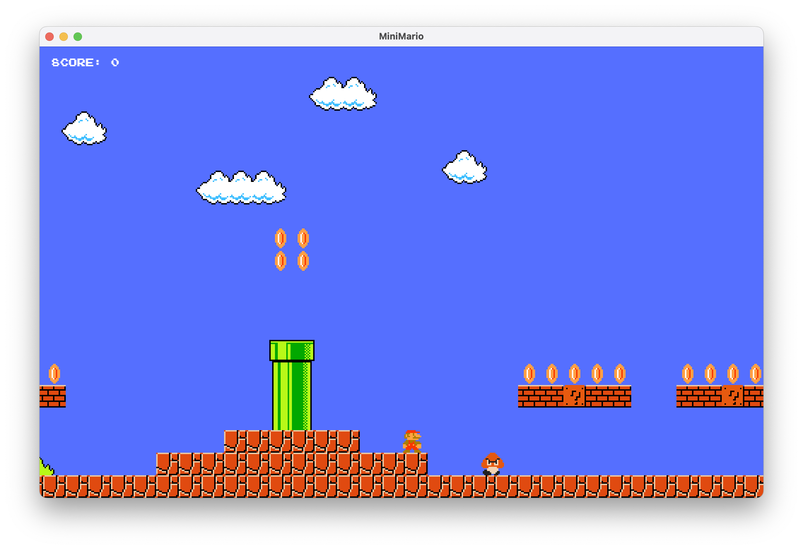

# MiniMario

A simple 2D platformer game inspired by Super Mario Bros., written in C++ using the SFML library.



## How to build

Make sure you have SFML installed (version 3.1.0 or higher) and the path to the SFML libraries is in your `DYLD_LIBRARY_PATH` environment variable.

First, clone the repository:

```
git clone https://github.com/mloporchio/MiniMario.git
```

Then, run the following command:

```
make all
```

## How to run

To launch the game, just run:

```
DYLD_LIBRARY_PATH=~/SFML-3.1.0/lib ./MiniMario
```